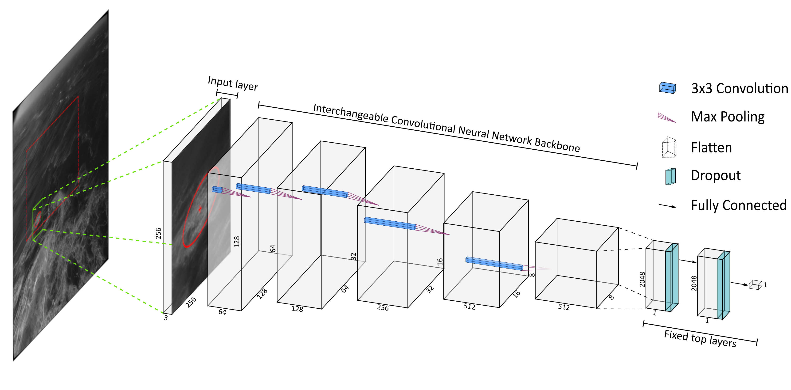
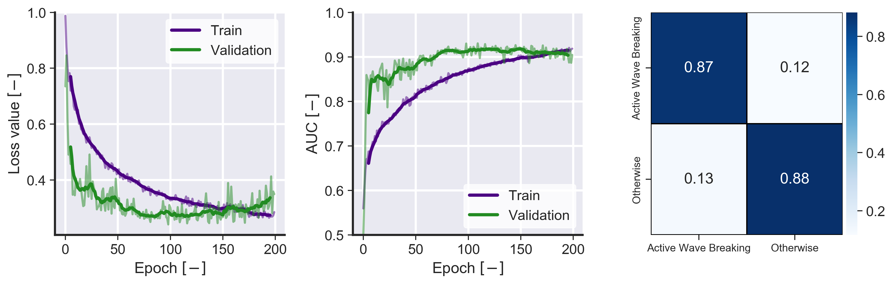

<!-- [](https://www.overleaf.com/read/mhprcfwhryfw) [](https://www.overleaf.com/read/mhprcfwhryfw) -->

# Deep Neural Networks for Active Wave Breaking Classification

This repository contains code and data to reproduce the results of the paper **Deep Neural Networks for Active Wave Breaking Classification** currently under review.

## Contents

[Deep Neural Networks for Active Wave Breaking Classification](#deep-neural-networks-for-active-wave-breaking-classification)

-   [1. Dependencies](#1-dependencies)
-   [2. Data](#2-data)
    -   [2.1. Manual Creation](#21-manual-creation)
    -   [2.2. Production Ready](#22-production-ready)
-   [3. Training](#3-training)
    -   [Pre-trained Models](#pre-trained-models)
-   [4. Model Performance](#4-model-performance)
    -   [4.1. Evaluating](#41-evaluating)
    -   [4.2. Results](#42-results)
-   [5. Using a Pre-trained Neural Network](#5-using-a-pre-trained-neural-network)
    -   [5.1 Predicting on New Data](#51-predicting-on-new-data)
    -   [5.2. Predicting from the Results of the Naïve Detector](#52-predicting-from-the-results-of-the-na-ve-detector)
    -   [5.3. Plotting Wave Breaking Detection Results](#53-plotting-wave-breaking-detection-results)
-   [6. Model Interpretation](#6-model-interpretation)
-   [7. Active Wave Breaking Segmentation](#7-active-wave-breaking-segmentation)
-   [8. Wave Tracking](#8-wave-tracking)
-   [9. Wave Breaking Statistics](#9-wave-breaking-statistics)
-   [Gallery](#gallery)
-   [Standard Variable Names](#standard-variable-names)
-   [Disclaimer](#disclaimer)

## 1. Dependencies

### Using [`conda`](https://docs.conda.io/en/latest/):

- **Windows**
```bash
conda env create -f environment_win.yml
```

- **Linux**
```bash
conda env create -f environment_linux.yml
```


### Manually
<details>
  <summary> Package list </summary>

  ```bash
  # install GIT
  conda install git

  # create a new environment
  conda create --name tf python=3

  # activate your new environment
  conda activate tf

  # If you have a nvidia GPU installed and properly configured
  pip install --upgrade pip
  pip install tensorflow

  # extras
  pip install -q git+https://github.com/tensorflow/examples.git
  pip install tensorflow_addons
  conda install numba

  # Natsort - better file sorting
  conda install natsort

  # Classical machine learning
  conda install pandas scikit-learn scikit-image

  # Extra thresholding methods
  pip install pythreshold

  # fitting circles to data
  pip install miniball

  # parallel computations
  pip install pebble

  # Matplotlib and seaborn
  conda install matplotlib seaborn

  # netCDF support
  conda install netCDF4 xarray

  # make your life easier with ipython
  conda install ipython
  ```
</details>
<br/>


## 2. Data

### 2.1. Manual Creation

-   Refer to [Manual Data Preparation](util/README.md).

### 2.2. Production Ready

| Model                     | Link                                                                                                                     | Alternative link |
| ------------------------- | ------------------------------------------------------------------------------------------------------------------------ | ---------------- |
| **Train (10k)**           | [](https://drive.google.com/file/d/1Qko68JTZT-JLHKwSJJvvKUQEjmcy0V0j/view?usp=sharing) | -                |
| **Train (20k)**           | [](https://drive.google.com/file/d/1uUcSW5s_jm5W-AQeeNxJKbIr6CR5fJIP/view?usp=sharing) | -                |
| **Test (1k)**             | [](https://drive.google.com/file/d/1A6IK9IQjFN9JMNx3bUkcWdlO8YN8PbaC/view?usp=sharing) | -                |
| **Black Sea (200k)**      | [](https://drive.google.com/file/d/1hh6tMpfEXHNWJm0OQp_d_RMZyeQS55yq/view?usp=sharing) | -                |
| **La Jument 2019 (100k)** | **Upcoming**                                                                                                             | -                |

## 3. Training

[](https://colab.research.google.com/drive/1b7h90t3EJx91UTyzCQq8YSyTYzW_lJnZ?usp=sharing) **\|** [](notebook/train.ipynb)

**Note**: The training dataset used here is a smaller version (10k) of the published dataset so it can run on Google Colab. The 20K dataset takes over 6 hours to train and Google will disconnect your session.

The data needs to be in a folder which has sub-folders "0" and "1"

For example:

    train
        ├───0
        ├───1

There are 5 `backbones` implemented: `VGG16`, `ResNet50V2`, `InceptionResNetV2`, `MobileNetV2` and `EfficientNet`

Note that the weights from these pre-trained models will be reset and
updated from the scratch here. These models have no knowledge of the present data and, consequently, transferred learning does not work well.

**Example**

```bash
python train.py --data "train/" --backbone "VGG16" --model "vgg_test" --logdir "logs/" --random-state 11 --validation-size 0.2 --learning-rate 0.00001 --epochs 200 --batch-size 64 --dropout 0.5 --input-size 256 256
```

<details>
  <summary> Arguments: </summary>

-   `--data` Input train data path.

-   `--model` Model name.

-   `--backbone` Which backbone to use. See above.

-   `--random-state` Random seed for reproducibility. Default is 11.

-   `--validation-size` Size of the validation dataset. Default is 0.2.

-   `--epochs` Number of epochs (iterations) to train the model. Default is 200.

-   `--batch-size` Number of images to process in each step. Decrease if running into memory issues. Default is 64.

-   `--dropout` Droput percentage. Default is 0.5.

-   `--input-size` Image input size. Decrease if running into memory issues. Default is 256x256px.
</details>
<br/>

The neural network looks something like this:



### Pre-trained Models

Please use the links below to download pre-trained models:

**Scientific Reports (20K dataset)**

| Model                 | Link                                                                                                                     | Alternative link |
| --------------------- | ------------------------------------------------------------------------------------------------------------------------ | ---------------- |
| **VGG16**             | [](https://drive.google.com/file/d/1J5xAG00dKC5VOjaO1vv8CZTmgHKNTlYk/view?usp=sharing) | -                |
| **ResNet50V2**        | [](https://drive.google.com/file/d/1pV_Kaq2nRlxNJYvgQP84dGxniR6JkbV2/view?usp=sharing) | -                |
| **InceptionResNetV2** | [](https://drive.google.com/file/d/1djw0iSvTSdIwTFw_BsEMfbEKL4J1DZb9/view?usp=sharing) | -                |
| **MobileNet**         | [](https://drive.google.com/file/d/1N0N03QDevACbOAi0Vq9tAMShYBX6s8EA/view?usp=sharing) | -                |
| **EfficientNet**      | [](https://drive.google.com/file/d/1Lb1bYKfIBZXGV4X4tzSXuj-abIvFiJoE/view?usp=sharing) | -                |

**Black Sea (200k dataset)**

| Model                 | Link                                                                                                                     | Alternative link |
| --------------------- | ------------------------------------------------------------------------------------------------------------------------ | ---------------- |
| **VGG16**             | [](https://drive.google.com/file/d/1Oy_4q4SJpg0TVE8LWXR7L57S0zD8MP7T/view?usp=sharing) | -                |
| **ResNet50V2**        | [](https://drive.google.com/file/d/1Exs1_bpE9Rqk9aPDlzfH4HDgF2wygR4c/view?usp=sharing) | -                |
| **InceptionResNetV2** | [](https://drive.google.com/file/d/1tKIEWKr6G8RtwsTk1vqg9UJB8cx2M8J5/view?usp=sharing) | -                |
| **MobileNet**         | [](https://drive.google.com/file/d/15Roa1tjtoXbn2w-H0OAcfWVNXMKgr_fV/view?usp=sharing) | -                |
| **EfficientNet**      | [](https://drive.google.com/file/d/1_JEAJYfD3-QUSEReJOI7aI2QBr4LlafP/view?usp=sharing) | -                |

**Note**: These models were trained from the scratch with data processed by Pedro Guimarães. Overall, they have accuracy scores higher than 95% but the training data is less general than the 20K dataset seen in the paper.

**La Jument (100K dataset)**

| Model                 | Link         | Alternative link |
| --------------------- | ------------ | ---------------- |
| **VGG16**             | **Upcoming** | -                |
| **ResNet50V2**        | **Upcoming** | -                |
| **InceptionResNetV2** | **Upcoming** | -                |
| **MobileNet**         | **Upcoming** | -                |
| **EfficientNet**      | **Upcoming** | -                |

**Note**: Work in progress.

## 4. Model Performance

### 4.1. Evaluating

[](https://colab.research.google.com/drive/1z8KY_krozpfG5wPomNu-fiq4D_OLMgxW?usp=sharing) **\|** [](notebook/test.ipynb)

To evaluate a pre-trained model on test data, use the [`test`](src/test.py) script.

**Example:**

```bash
python test.py --data "path/to/test/data/" --model "VGG16.h5" --threshold 0.5 -- output "path/to/results.csv"
```

<details>
  <summary> Arguments: </summary>

-   `--data` Input test data. Use same structure as when training.

-   `--model` Pre-trained model.

-   `--threshold` Threshold for binary classification. Default is 0.5

-   `--output` path to save the results.
    </details>
    <br/>

The `classification report` with be printed on the screen. For example:

                  precision    recall  f1-score   support

             0.0       0.88      0.99      0.94      1025
             1.0       0.87      0.23      0.36       175

        accuracy                           0.88      1200
       macro avg       0.88      0.61      0.65      1200
    weighted avg       0.88      0.88      0.85      1200

To summarize the model metrics do:

```bash
python metrics.py --data "path/to/data/" --model "VGG16.h5" --threshold 0.5 -- output "path/to/metrics.csv"
```

The arguments are the same as above.

The results look something like this:

| VGG16      | Binary_Accuracy | True_Positives | False_Positives | True_Negatives | False_Negatives | Precision | Recall | AUC  |
| ---------- | --------------- | -------------- | --------------- | -------------- | --------------- | --------- | ------ | ---- |
| Train      | 0.89            | 771.00         | 248.00          | 5680.00        | 521.00          | 0.76      | 0.60   | 0.92 |
| Validation | 0.87            | 100.00         | 19.00           | 1463.00        | 222.00          | 0.84      | 0.31   | 0.90 |
| Test       | 0.88            | 40.00          | 6.00            | 1019.00        | 135.00          | 0.87      | 0.23   | 0.82 |

To plot the training curves and a confusion matrix, do:

```bash
python plot_history_and_confusion_matrix.py --history "path/to/history.csv" --results "path/to/results.csv" --output "figure.png"
```

<details>
  <summary> Arguments: </summary>

-   `--history` Training history. Comes from `train_wave_breaking_classifier_v2.py`.

-   `--results` Classification results from the test data. Comes from `test_wave_breaking_classifier.py`.

-   `--output` Figure name.
    </details>
    <br/>

The results look like this:


### 4.2. Results

The table below summarizes the results presented in the paper. Results are sorted by `AUC`.

**Train**

| Model             | Accuracy | TP   | FP   | TN    | FN   | Precision | Recall | AUC   |
| ----------------- | -------- | ---- | ---- | ----- | ---- | --------- | ------ | ----- |
| ResNetV250        | 0.97     | 1414 | 198  | 13978 | 280  | 0.877     | 0.835  | 0.989 |
| VGG16             | 0.93     | 855  | 273  | 13911 | 831  | 0.758     | 0.507  | 0.943 |
| InceptionResnetV2 | 0.927    | 886  | 359  | 13823 | 802  | 0.712     | 0.525  | 0.932 |
| EfficientNet      | 0.772    | 1403 | 3346 | 10920 | 297  | 0.295     | 0.825  | 0.874 |
| MobileNet         | 0.904    | 436  | 268  | 13916 | 1250 | 0.619     | 0.259  | 0.848 |

**Validation**

| Model             | Accuracy | TP  | FP  | TN   | FN  | Precision | Recall | AUC   |
| ----------------- | -------- | --- | --- | ---- | --- | --------- | ------ | ----- |
| VGG16             | 0.932    | 221 | 65  | 3478 | 204 | 0.773     | 0.52   | 0.946 |
| ResNetV250        | 0.919    | 197 | 97  | 3450 | 224 | 0.67      | 0.468  | 0.873 |
| InceptionResnetV2 | 0.921    | 190 | 81  | 3466 | 231 | 0.701     | 0.451  | 0.93  |
| EfficientNet      | 0.809    | 353 | 687 | 2856 | 72  | 0.339     | 0.831  | 0.897 |
| MobileNet         | 0.908    | 123 | 64  | 3479 | 302 | 0.658     | 0.289  | 0.878 |

**Test**

| Model             | Accuracy | TP  | FP  | TN   | FN  | Precision | Recall | AUC   |
| ----------------- | -------- | --- | --- | ---- | --- | --------- | ------ | ----- |
| VGG16             | 0.876    | 106 | 80  | 945  | 69  | 0.57      | 0.606  | 0.855 |
| ResNetV250        | 0.881    | 95  | 63  | 962  | 80  | 0.601     | 0.543  | 0.843 |
| InceptionResnetV2 | 0.882    | 91  | 57  | 968  | 84  | 0.615     | 0.52   | 0.839 |
| EfficientNet      | 0.873    | 88  | 65  | 960  | 87  | 0.575     | 0.503  | 0.827 |
| MobileNet         | 0.875    | 30  | 5   | 1020 | 145 | 0.857     | 0.171  | 0.768 |

## 5. Using a Pre-trained Neural Network

### 5.1 Predicting on New Data

Create a dataset either manually or with the provided tools then use the [`predict`](src/test.py) script.  The data structure is as follows:

    pred
        ├───images
            ├───img_00001.png
            ├───img_00002.png
            ├───...
            ├───img_0000X.png

**Example:**

```bash
python predict.py --data "pred/" --model "VGG16.h5" --threshold 0.5 --output "results.csv"
```

<details>
  <summary> Arguments: </summary>

-   `--data` Input test data.

-   `--model` Pre-trained model.

-   `--threshold` Threshold for binary classification. Default is 0.5

-   `--output` A csv file with the classification results.
    </details>
    <br/>

### 5.2. Predicting from the Results of the Naïve Detector

Use [`predict from naïve candidates`](util/predict_from_naive_candidates.py) and the results from the [`naive wave breaking detector`](util/naive_wave_breaking_detector.py) and a pre-trained neural network to obtain only **active wave breaking** instances. This script runs on `CPU` but can be much faster on `GPU`.

**Example:**

```bash
python predict_from_naive_candidates.py --debug --input "naive_results.csv" --model "path/to/model.h5" --frames "path/to/frames/folder/"  --region-of-interest "region_of_interest.csv" --output "robust_results.csv" --temporary-path "tmp" --frames-to-plot 1000 --threshold 0.5
```

<details>
  <summary> Arguments: </summary>

-   `--debug` Runs in debug mode and will save output plots.

-   `-i [--input]` Input data obtained from `naive_wave_breaking_detector`.

-   `-m [--model]` Pre-trained Tensorflow model.

-   `-o [--output]` Output file name (see below for explanation).

-   `-frames [--frames]` Input path with images.

-   `--region-of-interest` File with region of interest. Use [`minimun bounding geometry`](util/minimum_bounding_geometry.py) to generate a valid input file.

-   `-temporary-path` Output path for debug plots.

-   `--frames-to-process` Number of frames to process.

-   `--from-frame` Start frame.

-   `--regex` Regular expression to find input frames. Default is `"[0-9]{6,}"`.

-   `--threshold` Threshold for activation in the last (sigmoid) layer of the model. Default is `0.5`.

      **_Note:_** The input data **_must_** have at least the following entries: `ic`, `jc`, `ir`, and `frame`.

    </details>
    <br/>

The output of this script is a comma-separated value (csv) file. It looks like exactly like the output of [`naive wave breaking detector`](util/naive_wave_breaking_detector.py) but adding a extra column with the results of the classification.

### 5.3. Plotting Wave Breaking Detection Results

Plot the results of the wave breaking detection algorithms. Can handle outputs of any algorithm, as long as the input data is correct. Ideally the results from [`cluster.py`](tracking/cluster.py) are used as input.

**Example:**

```bash
python plot_wave_breaking_detection_results.py --input "clustered_events.csv" --output "path/to/output/" --frames "path/to/frames/" --region-of-interest "path/to/roi.csv" --frames-to-plot 1000
```

<details>
  <summary> Arguments: </summary>

-   `-i [--input]` Input csv file.

-   `-o [--output]` Output path.

-   `-frames-path` Path with frames.

-   `--region-of-interest` File with region of interest. Use [`minimun bounding geometry`](../../util/minimum_bounding_geometry.py) to generate a valid input file.

-   `--frames-to-plot` Number of frames to plot.

-   `--from-frame` Number of frames to plot.

-   `--regex` Regular expression to find input frames. Default is `"[0-9]{6,}"`.

**_Note:_** The input data **_must_** have at least the following entries: `ic`, `jc`, `ir`, `frame`, `wave_breaking_event`.

</details>

## 6. Model Interpretation

[](https://colab.research.google.com/drive/1ERFWwwRmLtfzIOKSK_x5d6jpIAi2rM6d?usp=sharing) **\|** [](notebook/interpret.ipynb)

Use [`interpret.py`](src/interpret.py) to apply Grad-CAM to data samples. Organize your data as follows:

    gradcam
        ├───images
            ├───img_00001.png
            ├───img_00002.png
            ├───...
            ├───img_0000X.png

**Example:**

```bash
python interpret.py --data "path/to/gradcam" --model "VGG16.h5" -o "path/to/output"
```

<details>
  <summary> Arguments: </summary>

-   `-data` Input image data path.

-   `-o [--output]` Output path.

-   `-model` pre-trained VGG16 model.

  **Note**: This script will only work with VVG16 models.

</details>
<br/>

## 7. Active Wave Breaking Segmentation

The neural networks developed here call also be used for image segmentation. Please refer to [`Image Segmentation`](segmentation/README.md).

## 8. Wave Tracking

Please refer to [`Wave Tracking`](tracking/README.md).

## 9. Wave Breaking Statistics

Please refer to [`Wave Breaking Statistics`](stats/README.md).

## Gallery

**La Jument:**


**Black Sea:**


**Aqua Alta:**


<!-- **La Jument (2019):**

**Note:** This is a production example. The model has not seen this data before.

 -->

**Grad-CAM (Black Sea):**


**Image Segmentation (La Jument):**


## Standard Variable Names

The following variables are standard across this repository and scripts that output these quantities should use these names. If a given script has extra output variables, these are documented in each script.

<details>
  <summary> Variables </summary>

| Variable              | Description                                                                                                                                                 |     |
| --------------------- | ----------------------------------------------------------------------------------------------------------------------------------------------------------- | --- |
| `x`                   | x-coordinate in metric coordinates.                                                                                                                         |     |
| `y`                   | y-coordinate in metric coordinates.                                                                                                                         |     |
| `z`                   | z-coordinate in metric coordinates.                                                                                                                         |     |
| `time`                | date and time. Use a format that [pandas.to_datetime()](https://pandas.pydata.org/pandas-docs/stable/reference/api/pandas.to_datetime.html) can understand. |     |
| `frame`               | sequential number.                                                                                                                                          |     |
| `i`                   | pixel coordinate in pixel units. Use [Matplotlib coordinate system](https://matplotlib.org/3.1.1/tutorials/intermediate/imshow_extent.html).                |     |
| `j`                   | pixel coordinate in pixel units. Use [Matplotlib coordinate system](https://matplotlib.org/3.1.1/tutorials/intermediate/imshow_extent.html).                |     |
| `ic`                  | center of a circle or ellipse in pixel coordinates.                                                                                                         |     |
| `jc`                  | center of a circle or ellipse in pixel coordinates.                                                                                                         |     |
| `xc`                  | center of a circle or ellipse in metric coordinates.                                                                                                        |     |
| `yc`                  | center of a circle or ellipse in metric coordinates.                                                                                                        |     |
| `ir`                  | radius in the i-direction.                                                                                                                                  |     |
| `jr`                  | radius in the j-direction.                                                                                                                                  |     |
| `xr`                  | radius in the x-direction.                                                                                                                                  |     |
| `yr`                  | radius in the y-direction.                                                                                                                                  |     |
| `theta_ij`            | angle of rotation of an ellipse with respect to the x-axis counter-clockwise.                                                                               |     |
| `theta_xy`            | angle of rotation of an ellipse with respect to the x-axis counter-clockwise.                                                                               |     |
| `wave_breaking_event` | unique wave breaking event id.                                                                                                                              |     |
| `vx`                  | velocity in the x-direction in m/s.                                                                                                                         |     |
| `vy`                  | velocity in the y-direction in m/s.                                                                                                                         |     |
| `vi`                  | velocity in the x-direction in pixels/frame.                                                                                                                |     |
| `vj`                  | velocity in the y-direction in pixels/frame.                                                                                                                |     |

</details>
<br/>

## Disclaimer

There is no warranty for the program, to the extent permitted by applicable law except when otherwise stated in writing the copyright holders and/or other parties provide the program “as is” without warranty of any kind, either expressed or implied, including, but not limited to, the implied warranties of merchantability and fitness for a particular purpose. the entire risk as to the quality and performance of the program is with you. should the program prove defective, you assume the cost of all necessary servicing, repair or correction.
