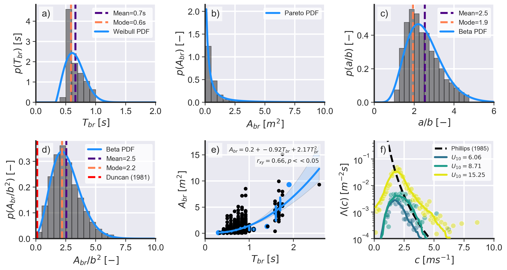

# **Wave breaking statistics**


The file ```data.pkl``` contains the following information:

Variable | Description
---------|------------
`Ab`     | Wave breaking area in squared meters.
`DT`     | Wave breaking duration in seconds.
`cb`     | Initial wave breaking speed in meters per second.
`cm`     | Mean wave breaking speed in meters per second.
`Lb`     | Wave breaking length in meters.
`Pb`     | Wave breaking length in meters (using the perimeter).
`LA`     | Major ellipse axis (a) in meters (using `np.sum`)
`LB`     | Minor ellipse axis (b) in meters (using `np.sum`)
`LA_max` | Major ellipse axis (a) in meters (using `np.max`). This is more reliable.
`LB_max` | Minor ellipse axis (a) in meters (using `np.max`). This is more reliable.
`wnd`    | Wind speed.
`svA`    | Stereo video reconstruction area in squared meters.
`svT`    | Acquisition duration in minutes.
`sv_fp`  | Peak wave frequency (Hertz).

To reproduce the plot seen in the paper, do:

```bash
python make_plot data.pkl ../docs/stats.png
```


